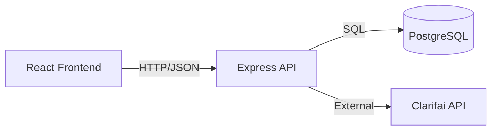

# 🧠 Smart Brain API


The backend API for the SmartBrain Face Detection web app.Built with Node.js and Express.js.
This server handles API routes, user entries, and face detection logic through integration with the Clarifai API.


## Tech Stack

- **Node.js** (runtime environment)
- **Express.js** (web framework)
- **PostgreSQL** + **Knex** — Relational database and query builder 
- **bcrypt** — Password hashing
- **CORS** (for front-end connection)
- **Dotenv** (environment configuration)
- **Clarifai API** — Face detection model 


## Architecture Overview


## Version History

| Version | Description |
|----------|--------------|
| **v1.1.1** | Code Review Improvements & Controller Refactor|
| **v1.1.0** | Connected to PostgreSQL using Knex, implemented real `/signin`, `/register`, `/image` endpoints with bcrypt password hashing and `.env` security configuration |
| **v1.0.0** | Initial backend setup with Express and Clarifai API |

---

## What I Learned

- Building an **Express.js** backend from scratch
- Handling API requests and integrating **Clarifai** for face detection
- Structuring **RESTful** endpoints with clean route organization
- Configuring **CORS** for communication between backend and frontend
- Managing environment variables securely with **.env**
- Connecting and querying a **PostgreSQL** database using **Knex**  
- Hashing passwords safely using **bcrypt**


## Setup

```bash
# Clone the repository from GitHub
git clone https://github.com/PedroTeixeira2308/Smart-brain-api.git

# Move into the project directory
cd Smart-brain-api

# Install dependencies
npm install

# Create a .env file in the root of the project
# Add your Clarifai Personal Access Token and fill with your database credentials 
# Example:
PORT=your_port
DB_HOST=127.0.0.1
DB_PORT=5432
DB_USER=postgres
DB_PASSWORD=your_password
DB_NAME=smart_brain
CLARIFAI_PAT=your_clarifai_personal_access_token

# Setup PostgreSQL Database via CLI
psql -U postgres

# Create the database
CREATE DATABASE smart_brain;

# Verify your connection details
\conninfo


# Create Database Schema

CREATE TABLE users (
  id SERIAL PRIMARY KEY,
  name VARCHAR(100),
  email TEXT UNIQUE NOT NULL,
  entries BIGINT DEFAULT 0,
  joined TIMESTAMP NOT NULL
);

CREATE TABLE login (
  id SERIAL PRIMARY KEY,
  hash VARCHAR(100) NOT NULL,
  email TEXT UNIQUE NOT NULL
);


# Start the server
# Option 1: Run manually
node server.js

# Option 2 — Use Node’s built-in watcher (Node v18+)
# --------------------------------------------------
# Modern alternative to Nodemon — automatically restarts on file changes
node --watch server.js

# Option 3 — Use Nodemon for automatic restarts during development
# ---------------------------------------------------------------
# If you don’t have nodemon installed yet, install it globally:
#   npm install -g nodemon
#
# Or install locally (dev dependency):
#   npm install --save-dev nodemon
#
# Then add this to your package.json scripts section:
#   "scripts": {
#     "start": "nodemon server.js"
#   }
#
# Now you can simply start the server with:
npm start

# Nodemon will automatically restart the server whenever you save changes

```

## Project Structure
```markdown
Smart-brain-api/
┣ controllers/
┃ ┣ clarifai.js
┃ ┣ image.js
┃ ┣ profile.js
┃ ┣ register.js
┃ ┗ signin.js
┣ .env.example
┣ .gitignore
┣ package.json
┣ package-lock.json
┣ README.md
┗ server.js
```

## Features

- Secure user registration and login

- Password encryption with bcrypt

- PostgreSQL integration via Knex.js

- RESTful API with clean structure

- Face detection endpoint integrated with Clarifai

- User entry count update logic

- JSON request handling via Express

- Environment configuration with **.env**

- CORS configuration for secure front-end access


## API Routes

| Method | Endpoint | Description |
|---------|-----------|--------------|
| **GET** | `/` | Root test endpoint |
| **POST** | `/signin` | Authenticates user using bcrypt |
| **POST** | `/register` | Registers a new user and hashes password |
| **PUT** | `/image` | Updates the user's image entry count |
| **POST** | `/api/clarifai/face-detect` | Sends image URL to Clarifai API for face detection |


## Author

Pedro Teixeira — Full-Stack Developer
[GitHub](https://github.com/PedroTeixeira2308) | [LinkedIn](https://www.linkedin.com/in/pedro-teixeira-967615347
)


## License

[MIT](https://choosealicense.com/licenses/mit/)